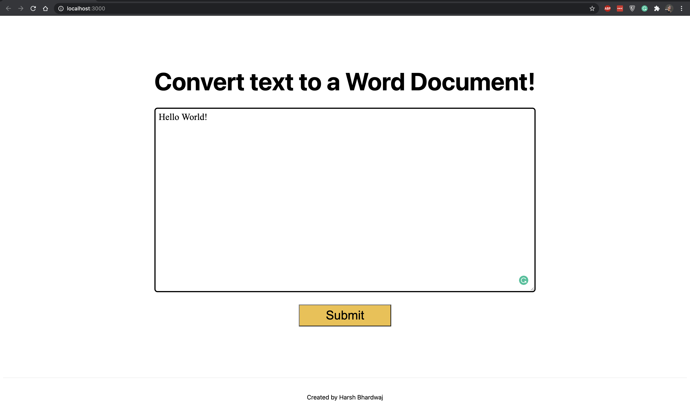

This is a [Next.js](https://nextjs.org/) project which returns a Word document containing the text returned by the user.

## Getting Started

First, run the development server:

```bash
npm run dev
# or
yarn dev
```

Open [http://localhost:3000](http://localhost:3000) with your browser to see the result.

Output:




